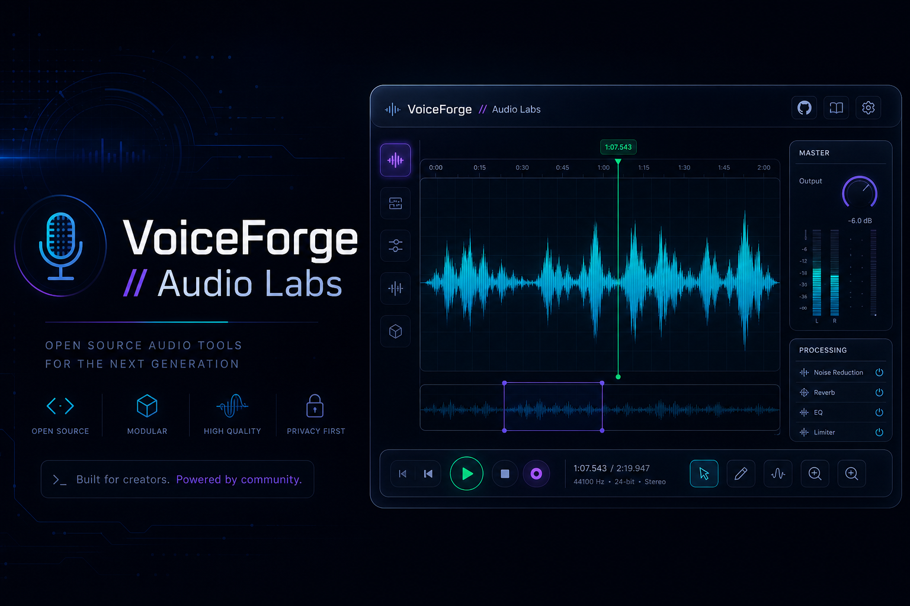
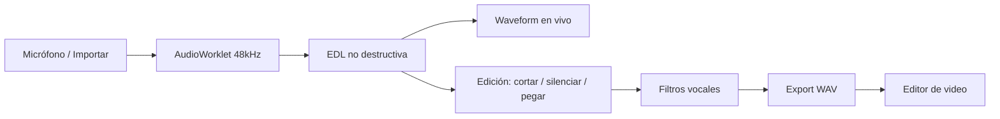

# VoiceForge // Audio Labs

<p align="center">
  
</p>

<p align="center">
  <strong>Editor de audio web profesional para voz en off</strong><br>
  Grabación en vivo · Edición sin clics · Filtros vocales · Export listo para video
</p>

<p align="center">
  
  
  
  
</p>

---

## ¿Qué es VoiceForge?

**VoiceForge** es un editor de audio que corre **100% en tu navegador**. No hay backend, no hay API keys, no hay cuentas ni suscripciones. Tu audio **nunca sale de tu máquina** salvo cuando tú exportas el WAV.

Lo construí para **creadores de video**, podcasters y locutores que necesitan:

- Grabar voz en off con **onda en vivo** mientras hablas
- **Cortar, silenciar y pegar** sin pops ni clics en las uniones
- Aplicar **filtros vocales** (noise gate, EQ, normalización)
- Exportar audio **compatible con editores de video** (Premiere, CapCut, DaVinci…)

> Proyecto personal de [Whoami-Labs](https://github.com/whoami-labs) — libre, abierto y listo para que lo uses, lo estudies o lo mejores.

---

## Características principales

| Feature | Descripción |
|---------|-------------|
| **Grabación PCM en vivo** | AudioWorklet a 48 kHz — ves la onda crecer mientras grabas |
| **Edición en vivo** | Selecciona, corta o silencia **mientras sigues grabando** |
| **EDL no destructiva** | Historial de hasta 50 operaciones sin clonar buffers enteros |
| **Anti-clics** | Zero-crossing + crossfade 15 ms + ramps en play/pause |
| **Waveform interactiva** | Zoom, selección, ventana fija 30 s al grabar, canvas HiDPI |
| **Filtros vocales** | Presets Podcast / Radio, noise gate, smart silence |
| **Export para video** | Estéreo dual-mono 16-bit por defecto (L=R, sin audio en un solo canal) |
| **Privacidad total** | Cero dependencias de servidor — solo archivos estáticos |

---

## Demo rápida

```
1. Abrir VoiceForge en el navegador
2. Grabar → ver la onda en tiempo real
3. Seleccionar un error → Cortar o Silenciar
4. Aplicar filtros → Exportar WAV
5. Importar el WAV en tu editor de video
```

---

## Inicio rápido

### Windows (recomendado)

En la carpeta `scripts/`:

| Script | Acción |
|--------|--------|
| `VoiceForge-Abrir.bat` | Inicia el servidor en segundo plano y abre el navegador |
| `VoiceForge-Cerrar.bat` | Detiene el servidor |

Crea un acceso directo en el escritorio apuntando a `VoiceForge-Abrir.bat`.

### Manual (cualquier SO)

```bash
cd VoiceForge
py -m http.server 8765
# o: python -m http.server 8765
```

Abre **http://localhost:8765** en Chrome o Edge.

> Los módulos ES y AudioWorklet **no funcionan** abriendo `index.html` directamente (`file://`).

---

## Atajos de teclado

| Tecla | Acción |
|-------|--------|
| `Espacio` | Play / Pausa |
| `Ctrl + Z` | Deshacer |
| `Ctrl + Y` | Rehacer |
| `Supr` / `Backspace` | Cortar selección |
| `Ctrl + M` | Silenciar selección |

---

## Exportación de audio

| Formato | Cuándo usarlo |
|---------|---------------|
| **Video (estéreo dual-mono 16-bit)** | Default — ideal para video creators |
| Estéreo dual-mono 32-bit | Más headroom antes de masterizar |
| Mono 32-bit | Archivo maestro |
| Mono 16-bit | Máxima compatibilidad |

El modo **dual-mono** pone la misma señal en L y R para que ningún editor de video reproduzca audio solo por un canal.

---

## Arquitectura

```
VoiceForge/
├── index.html / index.css     # UI glassmorphism (Whoami-Labs)
├── app.js                     # Orquestador
├── audio-engine.js            # AudioContext, playback, grabación
├── audio-recorder-processor.js# AudioWorklet PCM
├── edit-stack.js              # EDL + undo/redo
├── splice-utils.js            # Zero-cross, crossfade, smart silence
├── waveform.js                # Canvas HiDPI + picos en vivo
├── audio-filters.js           # EQ presets + noise gate
├── audio-worker.js            # DSP en Web Worker
├── wav-exporter.js            # WAV + dither TPDF
├── scripts/                   # Launchers Windows
└── docs/                      # Banner y assets
```

### Flujo de audio



### Cómo eliminamos los clics

1. **Grabación**: PCM directo vía AudioWorklet (sin compresión MediaRecorder en el camino principal).
2. **Edición**: búsqueda de zero-crossing ±15 ms + crossfade de 15 ms en cada unión.
3. **Reproducción**: rampas de ganancia de 10–15 ms al play/pause/stop.

---

## Presets de EQ vocal

| Preset | Cadena DSP |
|--------|------------|
| **Podcast** | High-pass 80 Hz · Peaking +2 dB @ 3 kHz (Q=1.0) |
| **Radio** | High-pass 100 Hz · Peaking +3 dB @ 2.5 kHz · Shelf +1.5 dB @ 8 kHz |

---

## Stack tecnológico

- **HTML5 + CSS3** (OKLCH, glassmorphism, CSS Grid)
- **JavaScript ES Modules** — sin React, sin bundler obligatorio
- **Web Audio API** — AudioWorklet, OfflineAudioContext, BiquadFilter
- **Canvas 2D** — waveform HiDPI con pirámide de picos
- **Web Workers** — noise gate y DSP sin bloquear la UI

**No se usa:** backend, base de datos, API externa, npm en runtime, claves de terceros.

---

## Límites conocidos

- Optimizado para clips de hasta **~30 minutos**
- Historial de **~50 operaciones** de edición
- AudioWorklet requiere **Chrome / Edge** (Firefox parcial; Safari con limitaciones)
- Edición interna en **mono**; export con opción estéreo dual-mono para video

---

## Contribuir

¡Las PRs son bienvenidas! Este es un proyecto abierto y personal:

1. Fork del repo
2. Crea una rama (`feat/mi-mejora`)
3. Commit con mensaje claro
4. Abre un Pull Request

Ideas para contribuir: soporte Safari, pistas estéreo reales, atajos extra, temas de UI, i18n.

---

## Privacidad y seguridad

- **No hay tracking**, analytics ni telemetría.
- **No hay `.env`** ni secretos en el repositorio.
- Todo el procesamiento ocurre en **tu navegador**.
- Los archivos de audio **no se suben a ningún servidor**.

---

## Licencia

[MIT](LICENSE) — Copyright (c) 2026 Whoami-Labs

Úsalo, modifícalo y compártelo libremente. Un crédito a Whoami-Labs se agradece pero no es obligatorio.

---

<p align="center">
  Hecho con dedicación por <strong>Whoami-Labs</strong><br>
  <em>VoiceForge — porque tu voz en off merece sonar profesional.</em>
</p>
